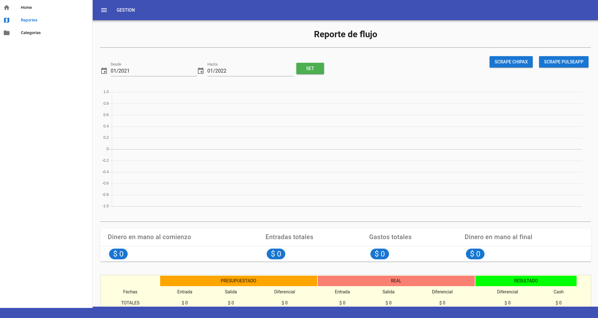

# Portafolio node.js, laravel, vue.js, vuetify de Igor Parra

- Ninguno de los códigos incluidos en este repo es ejecutable, son sólo retazos de aquí y de allá para mostrar estilo y estructuras.

## Vue.js y vuetify

- El directorio pwa contiene una muestra parcial de una aplicación de tipo progressive web application. Usa vuex para manejo de estados y axios para llamadas a api.

## Microservicio en lumen/laravel

- El directorio ms contiene una muestra parcial de una aplicación de tipo microservicio api hecha con lumen, que es un subconjunto de laravel.

## Backends en node.js

- El directorio api contiene una muestra parcial de una aplicación de tipo api hecha con node.js.

- En general este modelo de backend es el que uso siempre para apis o workers en node.js. Lo he ido afinando a traves del tiempo. Es muy flexible y eficiente.
  - Usa un modulo propio `module-koa-common` que tengo en un repo privado. En este caso lo incluyo como dependencia local.
- Se usa koa.js para usar async/await out of the box. 
- Se usa estructura [CLEAN](https://www.freecodecamp.org/news/a-quick-introduction-to-clean-architecture-990c014448d2/) (interpretación propia suceptible de mejorar):
  - application: Casos de uso:
    - PoisAll: Para vista inicial sin requerimeientos de entrada.
    - PoisSector: Para vistas sectorizadas dado un centro geográfico. Se requiren distancia, coordenadas del cetro y eventualmente categorias.
  - infrastructure: Rutas de la api y librerias 
    - container: Configura clases mediante injección de dependecias usando [Awilix](https://www.npmjs.com/package/awilix)
    - httpServer: Implementación de server HTTP usando middlewares koa.js
  - init.js: Inicialización de server.
  - interfaces: controlador api y repositorio de db
  - \_\_tests__: bateria de tests con jest y helper para test de integración via axios para simular llamadas api.

# Screenshots de apps vue.js

## Mapas y categorias

## Tablas y controles

## Red social con mapas y fotos

